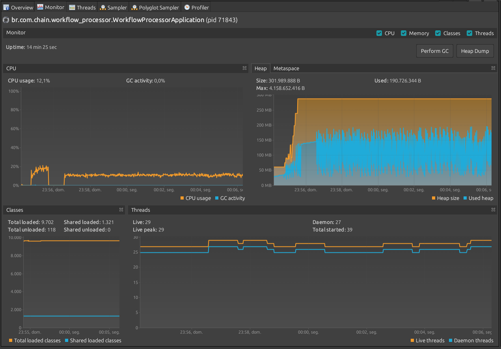
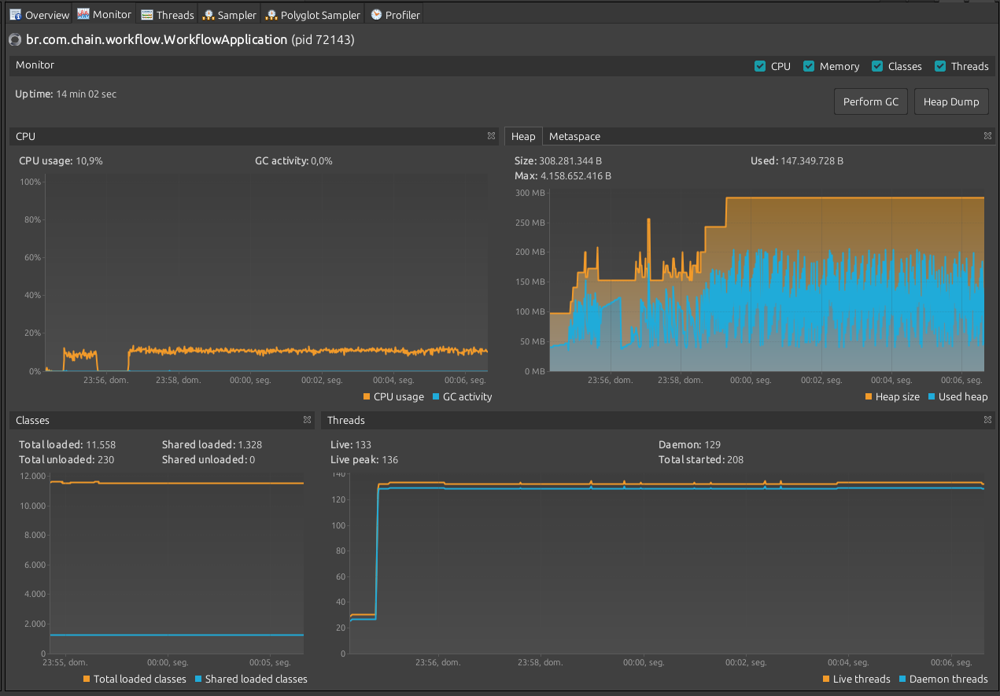

# Comparativo de Desempenho entre APIs Reativa e Bloqueante (Java 21 GraalVM)

Os testes de carga foram realizados utilizando o Apache JMeter, simulando 100 usuários simultâneos com uma rampa de 1 minuto. Cada uma das duas APIs, 'workflow-proccessor' e 'workflow', recebeu 500.000 requisições. Ambas as APIs foram executadas em um ambiente Java 21 GraalVM. A API 'workflow-proccessor' foi desenvolvida utilizando uma abordagem reativa com WebFlux, enquanto a API 'workflow' utilizou uma abordagem bloqueante tradicional.

###Workflow (Reativa)

### Workflow (normal)

**Análise Detalhada:**

| Métrica                  | workflow-proccessor | workflow  | TOTAL     |
| ------------------------ | ------------------- | --------- | --------- |
| Número de Amostras       | 500000              | 500000    | 1000000   |
| Média (ms)               | 178                 | 207       | 192       |
| Mediana (ms)             | 162                 | 186       | 173       |
| Percentil 90% (ms)       | 341                 | 389       | 366       |
| Percentil 95% (ms)       | 408                 | 459       | 436       |
| Percentil 99% (ms)       | 559                 | 613       | 590       |
| Mínimo (ms)              | 4                   | 2         | 2         |
| Máximo (ms)              | 1367                | 1437      | 1437      |
| Taxa de Erro (%)         | 0.000%              | 0.000%    | 0.000%    |
| Vazão (req/seg)          | 509.72816           | 477.84564 | 955.00494 |
| KB Recebidos por Segundo | 77.41               | 178.17    | 250.55    |
| KB Enviados por Segundo  | 70.73               | 63.98     | 130.19    |

**1. workflow-proccessor:**

- **# Samples:** 500,000 - Um número significativo de amostras, fornecendo dados estatísticos confiáveis.
- **Average:** 178 ms - Tempo de resposta médio razoável.
- **Median:** 162 ms - A maioria das requisições respondeu em 162 ms ou menos, indicando consistência.
- **Percentis (90%, 95%, 99%):** Os percentis mostram um aumento gradual, mas ainda em valores aceitáveis. Isso indica que a maioria das requisições teve um tempo de resposta consistente.
- **Min:** 4 ms - Tempo de resposta mínimo muito rápido.
- **Max:** 1367 ms - Tempo de resposta máximo consideravelmente alto, indicando variações significativas.
- **Error %:** 0.000% - Nenhuma requisição resultou em erro, o que é excelente.
- **Throughput:** 509.72816/sec - Um throughput alto, indicando que o servidor está processando muitas requisições por segundo.
- **Received KB/sec:** 77.41 - Taxa de recebimento de dados razoável.
- **Sent KB/sec:** 70.73 - Taxa de envio de dados razoável.

**2. workflow:**

- **# Samples:** 500,000 - Também um número significativo de amostras.
- **Average:** 207 ms - Tempo de resposta médio um pouco maior que "workflow-proccessor".
- **Median:** 186 ms - A maioria das requisições respondeu em 186 ms ou menos.
- **Percentis (90%, 95%, 99%):** Os percentis mostram um aumento maior em relação ao "workflow-proccessor", indicando maior variabilidade nos tempos de resposta.
- **Min:** 2 ms - Tempo de resposta mínimo muito rápido.
- **Max:** 1437 ms - Tempo de resposta máximo consideravelmente alto, indicando variações significativas.
- **Error %:** 0.000% - Nenhuma requisição resultou em erro, o que é excelente.
- **Throughput:** 477.84564/sec - Um throughput alto, mas ligeiramente menor que "workflow-proccessor".
- **Received KB/sec:** 178.17 - Taxa de recebimento de dados maior que "workflow-proccessor".
- **Sent KB/sec:** 63.98 - Taxa de envio de dados razoável.

**3. TOTAL:**

- **# Samples:** 1,000,000 - Número total de requisições.
- **Average:** 192 ms - Tempo de resposta médio geral.
- **Median:** 173 ms - Tempo de resposta mediano geral.
- **Percentis (90%, 95%, 99%):** Percentis gerais.
- **Min:** 2 ms - Tempo de resposta mínimo geral.
- **Max:** 1437 ms - Tempo de resposta máximo geral.
- **Error %:** 0.000% - Nenhuma requisição resultou em erro.
- **Throughput:** 955.00494/sec - Throughput geral.
- **Received KB/sec:** 250.55 - Taxa de recebimento de dados geral.
- **Sent KB/sec:** 130.19 - Taxa de envio de dados geral.

**Avaliação Geral:**

- Ambas as APIs apresentaram um bom desempenho geral, com tempos de resposta médios e medianos aceitáveis.
- A taxa de erros é excelente (0.000%), indicando estabilidade.
- O "workflow-proccessor" apresentou um desempenho ligeiramente superior em termos de tempo de resposta e throughput.
- O "workflow" apresentou um recebimento de dados muito maior.
- Os tempos máximos de resposta (Max) são consideravelmente altos em ambas as APIs, indicando variações significativas. Isso sugere que, embora a maioria das requisições seja rápida, algumas demoram muito mais.
- Os resultados indicam que o sistema testado está respondendo bem sob carga, mas há espaço para otimização.

